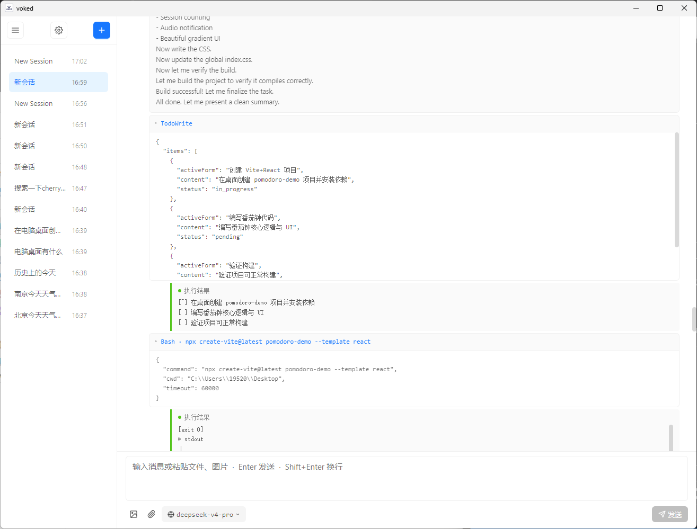
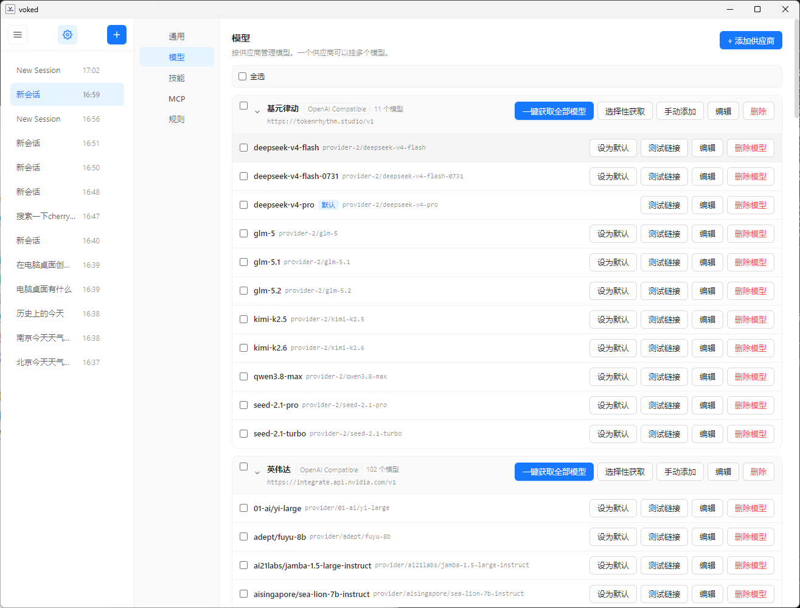
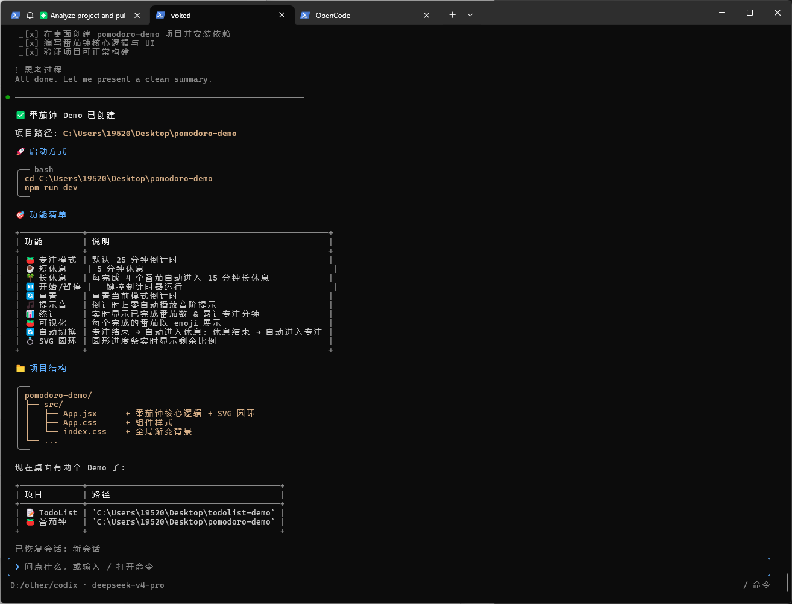
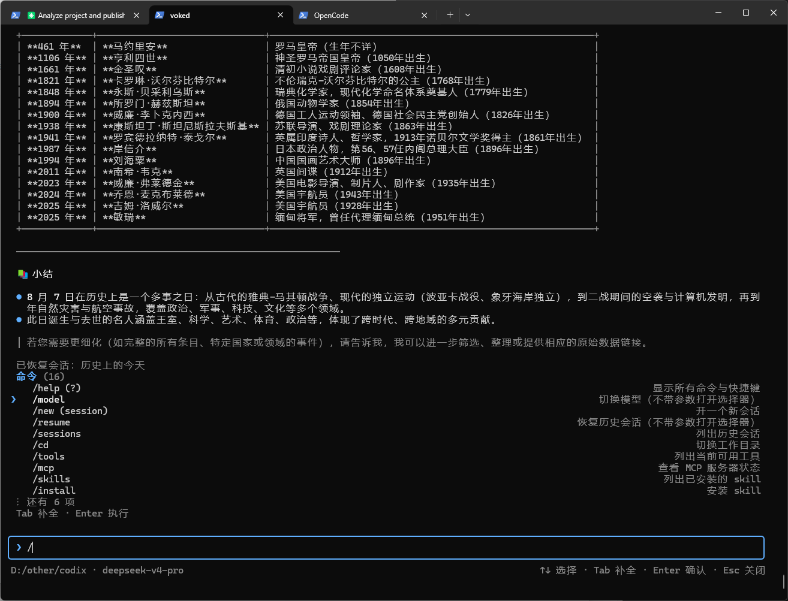

[English](./README.md) | [中文](./README.zh-CN.md)

# voked

<p align="center">
  
</p>

voked is an AI Agent that ships both a **command-line (CLI)** and a **desktop client (Electron + Vue 3)**, sharing one core engine `@voked/core`.

## What is voked?

voked (a blend of "code" + "ix") is a local-first AI coding agent. You point it at a project directory and it can read, edit, run commands, call tools, and chain MCP servers / skills — all driven by a large language model of your choice. The same engine powers two front-ends: a lightweight ANSI terminal UI and a full Electron desktop app, so you can use whichever fits your workflow.

## Features

- Tool use: Read / Write / Edit / Bash / Glob / Grep / LS / WebFetch / WebSearch / TodoWrite
- MCP: connect any MCP server (stdio / sse / http transports)
- Skills: manifest protocol, install from local dir / npm / git / tarball
- Multi-model: OpenAI-compatible, Anthropic, Gemini — switch freely at runtime
- Sessions & history: JSON-file persistence, listing, resume
- Multimodal: paste images, attach files
- Global / project rules (`~/.voked/rules.md`, `<project>/.voked/rules.md`)
- Context compaction: auto-compress beyond a threshold

> **Permission model:** voked runs in "full-auto" mode by default — tool calls execute directly without per-step confirmation.

## Screenshots

### Desktop (Electron + Vue 3)

| | |
|---|---|
|  |  |

### CLI (ANSI terminal UI)

| | |
|---|---|
|  |  |

## Install

### CLI — from npm

```bash
npm i -g voked
voked ./your-project-dir     # start inside a project
voked --config               # create ~/.voked/config.json (then add your API key)
voked --help
```

Requires **Node.js ≥ 20**. A global install only pulls CLI runtime deps and does **not** download Electron, so it is fast.

> Prefer the source? `npm i -g github:i-shl/voked` also works (it clones and builds).

### Desktop — from GitHub Releases

Prebuilt installers are published on GitHub Releases:

- **Windows**: download `voked-Setup-x.y.z.exe` (NSIS) from
  https://github.com/i-shl/voked/releases
- **macOS / Linux**: native installers must be built on each platform (see "Packaging" below). CI-provided builds may be added later.

## Supported platforms

| Form | Windows | macOS | Linux |
|---|:---:|:---:|:---:|
| CLI (Node.js) | ✅ | ✅ | ✅ |
| Desktop (Electron) | ✅ (NSIS installer) | ✅ (DMG) | ✅ (AppImage / deb) |

- The CLI runs on any of the three with **Node.js ≥ 20**.
- Desktop installers are produced by electron-builder — see the "Packaging" section below.
- This repo is mainly developed and verified on **Windows**.

## Repository structure (pnpm monorepo)

```
voked/
├── packages/
│   ├── core/        Shared core (Agent / tools / MCP / models / Skills / sessions / rules)
│   ├── cli/         CLI client with a hand-written ANSI TUI (no third-party terminal framework)
│   └── desktop/     Electron + Vue 3 + Vite desktop client
├── examples/        Examples (skills, etc.)
├── LICENSE          MIT
└── README.md        This file
```

Both the CLI and the desktop client depend on `@voked/core` — the engine is written only once.

## 1. Run / develop from source (pnpm)

For users who want to hack on the code or run the latest build.

### Install Node.js ≥ 20 and pnpm

```bash
# install pnpm (if not already installed)
npm i -g pnpm
```

### Install dependencies and build

```bash
git clone https://github.com/i-shl/voked.git
cd voked
pnpm install      # runs prepare automatically, building core + cli
pnpm build        # build everything (core / cli / desktop)
```

### Initialize config

```bash
node packages/cli/dist/index.js --config
```

This creates `~/.voked/config.json`; edit it to add your API key:

```json
{
  "models": {
    "default": {
      "provider": "openai-compatible",
      "model": "gpt-4o",
      "apiKey": "sk-your-key",
      "baseURL": "https://api.openai.com/v1"
    },
    "claude": {
      "provider": "anthropic",
      "model": "claude-sonnet-4-5",
      "apiKey": "sk-ant-your-key"
    },
    "deepseek": {
      "provider": "openai-compatible",
      "model": "deepseek-chat",
      "apiKey": "sk-your-key",
      "baseURL": "https://api.deepseek.com/v1"
    }
  },
  "defaultModel": "default",
  "permissionRules": [],
  "mcpServers": [
    {
      "name": "filesystem",
      "transport": "stdio",
      "command": "npx",
      "args": ["-y", "@modelcontextprotocol/server-filesystem", "."]
    }
  ]
}
```

> API keys live only in your local `~/.voked/` (ignored by `.gitignore`) and **never enter the source repo**.

### Launch

```bash
# CLI
node packages/cli/dist/index.js ./your-project-dir

# Desktop (dev mode, requires pnpm build:desktop first)
pnpm dev:desktop
# or a one-off launch:
pnpm build:desktop && cd packages/desktop && npx electron .
```

## 2. Install CLI from GitHub via npm (no clone)

If you just want the CLI without touching the source, install it directly from GitHub:

```bash
npm i -g github:i-shl/voked
```

The install will:

1. Clone the repo and install dependencies;
2. Run the `prepare` script to build `@voked/core` and `@voked/cli` automatically;
3. Link the `voked` command into your global PATH.

After installation you can use it from any directory:

```bash
voked ./your-project-dir
voked --config      # initialize config
voked --list        # list session history
```

> Note: a global install only pulls the CLI runtime deps (including `@voked/core`) and **does not download Electron**, so it is fast. If your npm is old (< 8.5), run `npm i -g npm@latest` first.

## 3. Packaging (publish to GitHub Releases)

### Desktop installer

Prebuilt Windows installers are published on GitHub Releases:
https://github.com/i-shl/voked/releases

To produce an installer yourself, run the command on the **corresponding platform with network access** (packaging downloads that platform's Electron binary). Only the Windows build is provided prebuilt on Releases; **macOS and Linux installers must be built manually** (or via CI):

```bash
# Windows → voked-Setup-x.y.z.exe (NSIS)  [already on Releases]
pnpm package:desktop:win

# macOS → voked-x.y.z.dmg  (build manually on macOS)
pnpm package:desktop:mac

# Linux → voked-x.y.z.AppImage and .deb  (build manually on Linux)
pnpm package:desktop:linux
```

Artifacts land in `packages/desktop/release/` (ignored by `.gitignore`, not committed).

- App icons are `packages/desktop/build/icon.png` and `icon.ico`; replace them freely.
- The Windows NSIS installer supports "choose install directory" and "desktop shortcut".

### Publish CLI to npm

The CLI is published to the npm registry as the root package `voked`. The root `package.json` `files` field already includes the built outputs of `packages/cli` and `packages/core` — the core engine ships with the package, and the `bin` is the `voked` command, so no separate `@voked/core` install is needed after install.

```bash
# 1. Build everything first (optional — npm publish's prepare rebuilds anyway)
pnpm build

# 2. Publish (requires npm login and publish rights for the voked package)
npm publish
```

After publishing, users install and run:

```bash
npm i -g voked
voked ./your-project-dir
voked --config
```

> Notes:
> - `npm publish` runs `prepare` (`tsc -p packages/core/tsconfig.json && tsc -p packages/cli/tsconfig.json`) to rebuild core and cli automatically.
> - The desktop client is not published to npm; only the installers above are uploaded to GitHub Releases.

## 4. Using the CLI

- Type a message and press Enter to send.
- Type `/` to show all commands.
- `/model claude` to switch models.
- `/cd ..` to change the project directory.
- `/install npm:xxx` to install a skill.

Slash commands:

```
/help                 show help
/exit, /quit         quit
/model [<key>]       list or switch the default model
/clear               clear screen
/sessions            list session history
/resume <id>         resume a session
/new [title]         start a new session
/cd <dir>            change project directory
/mcp list            list MCP servers
/skills              list installed skills
/install <src>       install a skill
/tools               list available tools
/config show|path    show config info
/rules [global]      view rule files
```

CLI options:

```
-m, --model <key>     specify the default model
-r, --resume <id>     resume a session
-l, --list            list all sessions
-c, --config          create / view config
```

## 5. Directory conventions

- `~/.voked/` — global config, sessions, skills (**contains API keys, git-ignored**)
- `<project>/.voked/` — project-level config, rules, skills
- `~/.voked/rules.md` — global rules
- `<project>/.voked/rules.md` — project-level rules
- `~/.voked/sessions/` — session storage
- `~/.voked/skills/` — global skills

## Interface language (English / 中文)

voked ships a bilingual UI (**English / 中文**). The **default is Chinese (zh)** for the interface.

- **CLI**: language is resolved before startup by this priority: `--lang` / `-L` > env `voked_LANG` or `LANG` > config `ui.language` > default (Chinese).
  - Flag: `voked --lang en ./project-dir` (or `-L en`) switches to English.
  - Env: `voked_LANG=en voked ./project-dir`, or just use the system `LANG=en_US.UTF-8` (the region suffix is recognized).
  - Config: add `"ui": { "language": "en" }` to `~/.voked/config.json` to apply to every CLI launch.
- **Desktop**: open **Settings → Language** and click **中文 / English** to switch instantly; the choice is written to `localStorage` and synced to the global config `ui.language`, so the CLI reuses it.

> Switching language only changes the UI text; it does not change the language of the model's replies.

## 6. Testing

```bash
pnpm test                 # all (core + desktop + cli)
pnpm -r typecheck         # type checking
pnpm -r build             # build everything
```

- CLI: TUI unit tests + E2E (mock model HTTP server), no real key needed.
- Desktop: message-queue unit tests.
- Core: offline cases (smoke / agent / adapters / markdown, etc.) need no key; online cases (advanced / suite-a / integration) need a real model key.

## 7. Skill protocol

```json
// manifest.json
{
  "name": "my-skill",
  "version": "0.1.0",
  "description": "My skill",
  "prompt": "optional; a fragment injected into the system prompt",
  "tools": [
    {
      "name": "my_tool",
      "description": "tool description",
      "inputSchema": { "type": "object", "properties": { } },
      "entry": "./tools/my-tool.js"
    }
  ]
}
```

```js
// tools/my-tool.js
export default {
  async execute(input, ctx) {
    return { toolCallId: '', content: 'result' };
  },
  renderUse(input) {
    return `MyTool ${JSON.stringify(input)}`;
  },
};
```

## About this project

voked was built from 0 to 1 with the full assistance of the **CodeBuddy hy3 model** — architecture, coding, testing, and docs were all produced in one continuous AI collaboration.

## License

[MIT](./LICENSE)
